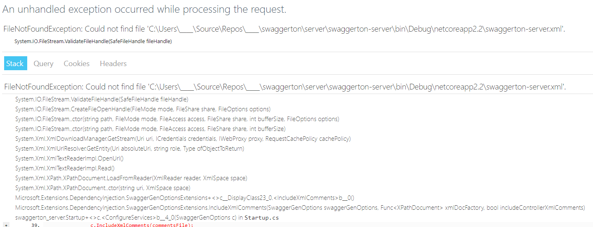
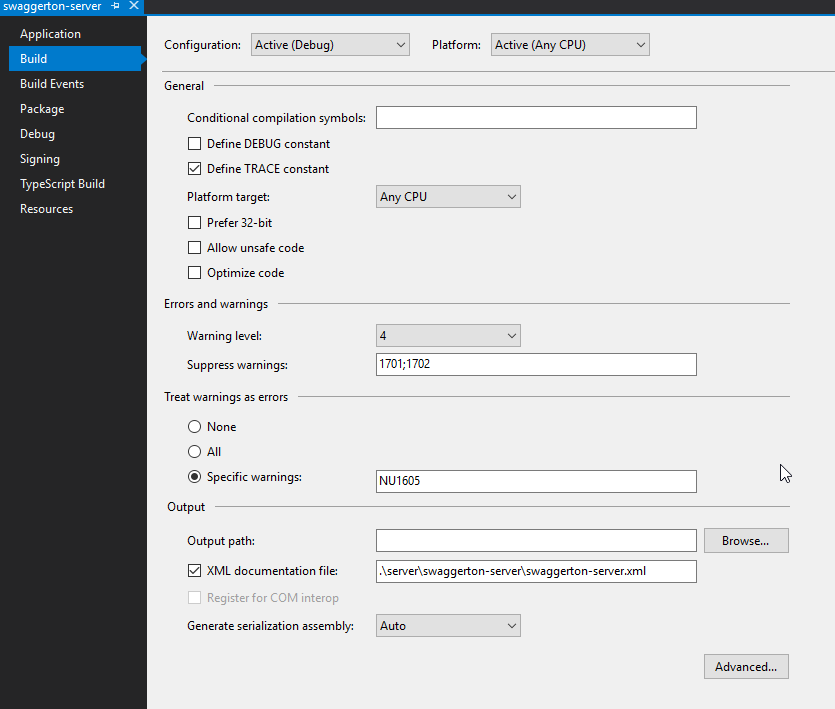
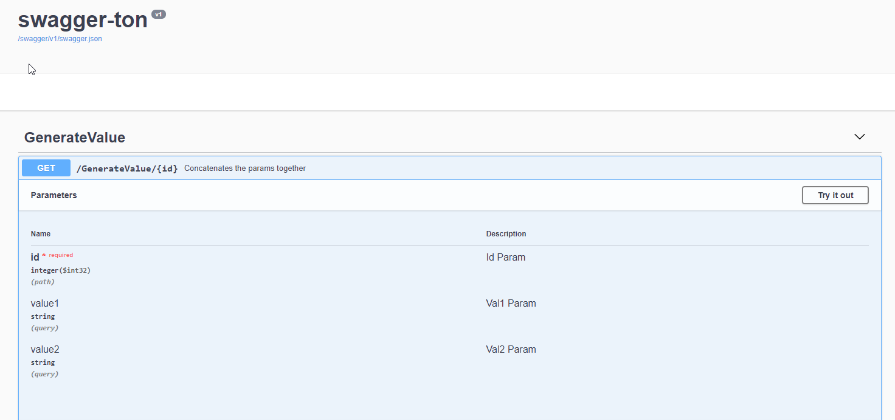
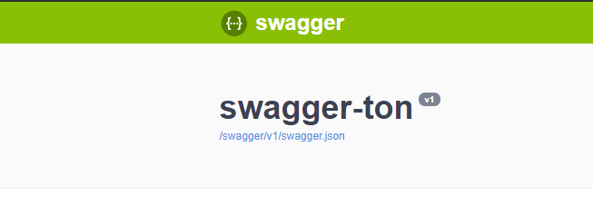
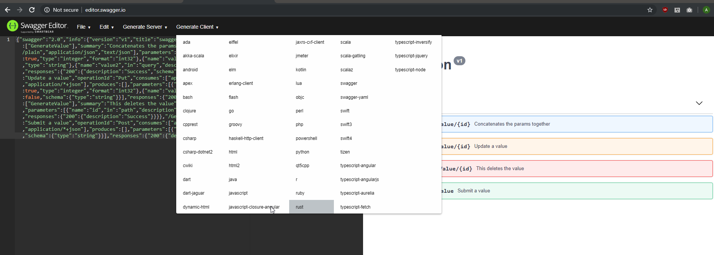
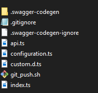

# Getting your .Net API from the server to the client with Swagger & Swashbuckle

The internet runs on APIs, and solid API specifications are as valuable as the tools that eventually implement them. Here at Rightpoint we realize there are many ways to write an API, just as there are many ways to spin up a server and consume the API with a webpage or some other client. We've found that .Net core and Typescript are great options for this. And just like how .Net and React stand out from the rest when it comes to implementing a web experience, so does Swagger come close to perfecting that first step in any significantly large web project, building and managing the API.

Throughout this post we're going to take a walk through swagger-ton, a small example .Net core Web API project, and with push-button-ease generate a Typescript React Client that uses the same API. We'll do this without actually writing any API boilerplate code ourselves! The credit to this miraculous cross-platform solution goes almost exclusively to the Swagger tool.

## What is Swagger / OpenAPI?

[Swagger](https://swagger.io/docs/specification/2-0/what-is-swagger/) (which is part of the OpenAPI initiative to standardize APIs across the internet) allows you to describe the structure of your APIs so that machines can read them. The ability of APIs to describe their own structure is the root of all the awesomeness in Swagger. Why is it so great? Well, by reading your API’s structure, we can automatically build beautiful and interactive API documentation. We can also automatically generate client libraries for your API in many languages and explore other possibilities like automated testing. Swagger does this by asking your API to return a YAML or JSON that contains a detailed description of your entire API. This file is essentially a resource listing of your API which adheres to OpenAPI Specification. The specification asks you to include information like:

- What are all the operations that your API supports?
- What are your API’s parameters and what does it return?
- Does your API need some authorization?

And even fun things like terms, contact information and license to use the API.
You can write a Swagger spec for your API manually, or have it generated automatically from annotations in your source code. Check swagger.io/open-source-integrations for a list of tools that let you generate Swagger from code.

## What is Swashbuckle?

Swashbuckle is a .Net library to generate swagger definitions by looking at the source code of your project. You can also get it to look at the XML documentation of your project to generate rich descriptions automatically.

## What is going to be shown?

1. Adding swagger to a .Net core Web API project
2. "Decorating" the project to get good description in the swagger UI
3. Generating client side Javascript from the swagger definition file

## Adding Swagger to your .Net core Web API project

This step is pretty simple. Add the Swashbuckle nuget package to your project. [Swashbuckle](https://github.com/domaindrivendev/Swashbuckle.AspNetCore) is package that implements Swagger definition files for you and also provides a UI based off your swagger definition.

1. Add the nuget package `Swashbuckle.AspNetCore`


Once that is added you will need to do a few things.

in ConfigureServices method in Startup.cs add the following

```
           services.AddSwaggerGen(c =>
           {
               c.SwaggerDoc("v1", new Info { Title = "swagger-ton", Version = "v1" });
           });
```

also in the Configure method on Startup.cs add the follow to generate swagger UI

```
            app.UseSwagger();
            app.UseSwaggerUI(c =>
            {
                c.SwaggerEndpoint("/swagger/v1/swagger.json", "swagger-ton V1");
            });
```

Now run the project (f5). Once the web browser shows up and loads the default route, change the relative path to /swagger and bam you got swagger.


You might notice that there are no descriptions of what the API will do. In the next section we will explore adding more metadata around your API's.

## "Decorating" the project to get good descriptions in the swagger UI

You will notice that there are no descriptions displayed or even a name associated to the operation.

In order to have descriptions we have to tell Swashbuckle how to pick them out. Swashbuckle supports using descriptions from XML comment documentation. Below is the code snippet that tells Swashbuckle to use comments as descriptions in the Swagger file.

```
            services.AddSwaggerGen(c =>
            {
                c.SwaggerDoc("v1", new Info { Title = "swagger-ton", Version = "v1" });
                var baseDirectory = AppDomain.CurrentDomain.BaseDirectory;
                var commentsFileName = Assembly.GetEntryAssembly().GetName().Name + ".xml";
                var commentsFile = Path.Combine(baseDirectory, commentsFileName);
                c.IncludeXmlComments(commentsFile);
            });
```

There is one more step if you run the project now it will throw an exception.



The XML comment needs to be generated. You can do this with the UI to generate the xml doc. In the path input field next to the checkbox make it a relative path so if you move this project to be part of devops it will generate the file correctly.



Now lets add some comments. Modify the controller to have XML comments

```
    /// <summary>
    /// This api is for values
    /// </summary>
    [Route("[controller]")]
    [ApiController]
    public class GenerateValueController : ControllerBase
    {
        /// <summary>
        /// Concatenates the params together
        /// </summary>
        /// <param name="id">Id Param</param>
        /// <param name="value1">Val1 Param</param>
        /// <param name="value2">Val2 Param</param>
        /// <returns></returns>
        [HttpGet("{id}")]
        public ActionResult<string> Get(int id,string value1, string value2)
        {
            return "value_" + id.ToString() + value1 + "_" + value2;
        }

        /// <summary>
        /// Submit a value
        /// </summary>
        /// <param name="value"></param>
        [HttpPost]
        public void Post([FromBody] string value)
        {
        }

        /// <summary>
        /// Update a value
        /// </summary>
        /// <param name="id">Id of value</param>
        /// <param name="value">The value to update</param>
        [HttpPut("{id}")]
        public void Put(int id, [FromBody] string value)
        {
        }

        /// <summary>
        /// This deletes the value
        /// </summary>
        /// <param name="id"></param>
        [HttpDelete("{id}")]
        public void Delete(int id)
        {
        }
    }
```

And here is the output from Swashbuckle UI.



## Generating client side Javascript from the swagger definition file

Now here comes the exciting part. From the swagger definition file we are going to generate client side code that you could incorporate into your React Typescript project.

First step is to download the swagger definition file. Its located at this link on the Swagger UI and the link would be https://localhost:44370/swagger/v1/swagger.json.



Now you are going to load the website http://editor.swagger.io/ and paste the file contents into left site. Click cancel to not convert to YAML. Once that is done and the linter passes you can choose from any number of generators.



Choose what type of client you want to generate for your project. In the example we are going to choose Typescript-fetch.

A Zip file with the contents is sent to you. In our case the files in the image below.



We care most about the api.ts and configuration.ts files those would normally get place in your client front end project. The API.ts file is quite large. Here is a [link to it from the repo.](./client/api.ts)

The beginning of our API client code is now largely complete, and the best part is, if we ever write another endpoint in our .Net web code, generating the client code for that endpoint needs only one step: the regeneration of the client code step. And if the project changes and we need to refactor significantly, say for example we want to use angular as well as typescript? We can just ask for that client to be generated as well.

Thanks for walking through this process with us. Automatic generation of the client from the swagger file is one of the most exciting things to come out of the OpenApi definition movement. We'll be continuing to leverage OpenApi in our .Net projects, and hope you will as well.
