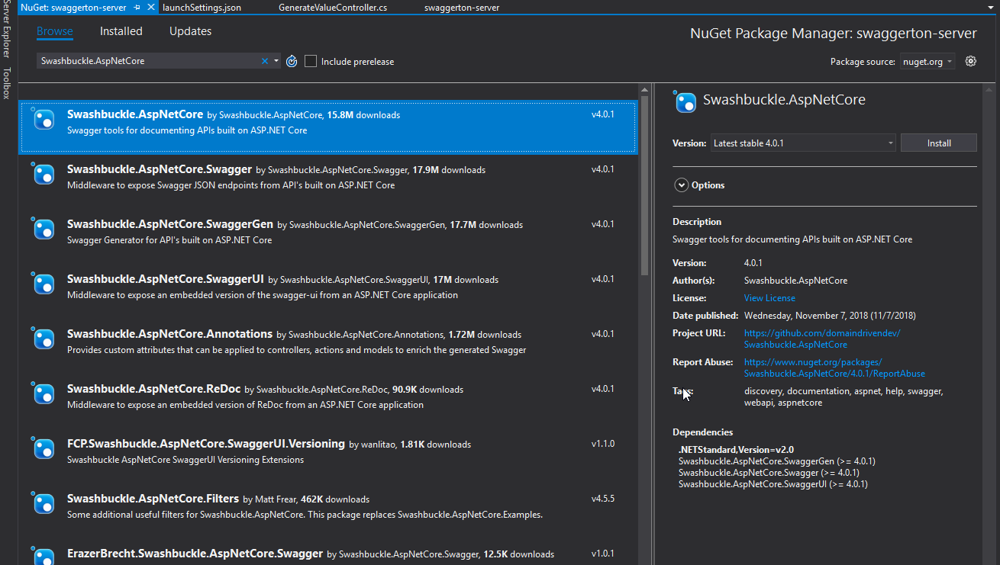
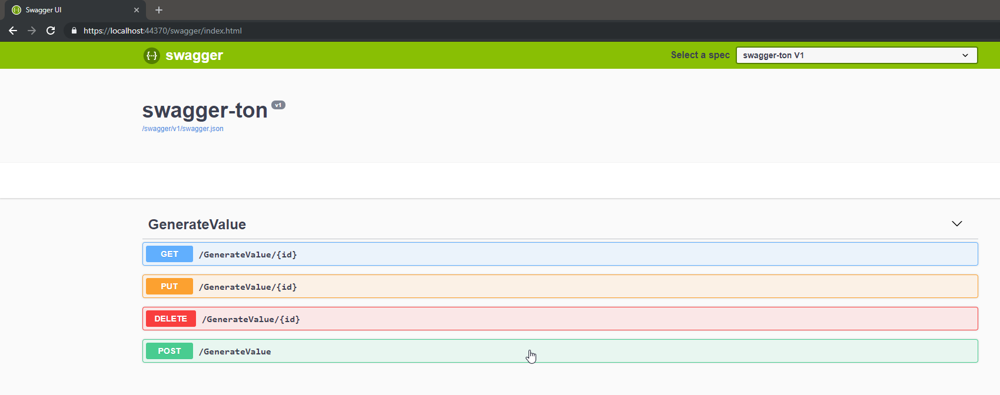

# Swaggerton

Going to take this to swaggerton or how to implement swagger/openAPI in .net core and also realize those contracts in a React Client with push button tooling from the swagger api description

## What is swagger or openAPI?

add some description here

## What is going to be shown?

1. Adding swagger to a .net core Web API project
2. "Decorating" the project to get good description in the swagger UI
3. Generating client side Javascript from the swagger definition file

## Adding swagger to your .net core Web API project

This step is pretty simple. Add the Swashbuckle nuget package to your project. [Swashbuckle](https://github.com/domaindrivendev/Swashbuckle.AspNetCore) is package that implements Swagger definition files for you and also provides a UI based off your swagger definition.

1. Add the nuget package `Swashbuckle.AspNetCore`



Once that is added you will need to do a few things.

in ConfigureServices method in Startup.cs add the following

```services.AddSwaggerGen(c =>
            {
                c.SwaggerDoc("v1", new Info { Title = "swagger-ton", Version = "v1" });
            });
```

also in the Configure method on Startup.cs add the follow to generate swagger UI

```
            app.UseSwagger();
            app.UseSwaggerUI(c =>
            {
                c.SwaggerEndpoint("/swagger/v1/swagger.json", "swagger-ton V1");
            });
```

Now run the project (f5). Once the web browser shows up and loads the default route, change the relative path to /swagger and bam you got swagger.


